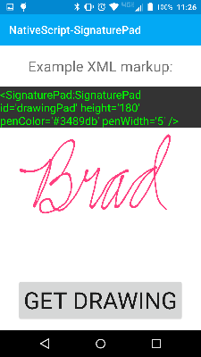

[](https://www.npmjs.com/package/nativescript-signaturepad)
[](https://www.npmjs.com/package/nativescript-signaturepad)

# NativeScript-SignaturePad :pencil:
NativeScript plugin to provide a way to capture signatures (or any drawing) from the device.
You can use this component to capture really anything you want that can be drawn on the screen. Go crazy with it!!!

## WARNING - iOS is in development and should be available soon. ANDROID ONLY for now.

#### Platform controls used: 
Android | iOS
---------- | -----------
[gcacace/android-signaturepad](https://github.com/gcacace/android-signaturepad) |  [SignatureView](https://cocoapods.org/pods/SignatureView)

## Installation
From your command prompt/termial go to your app's root folder and execute:

`npm install nativescript-signaturepad`

## Usage
#### XML:
```XML
<Page xmlns="http://schemas.nativescript.org/tns.xsd"
      xmlns:SignaturePad="nativescript-signaturepad">
     <StackLayout>
            <SignaturePad:SignaturePad
                height="200"
                id="drawingPad"     
                penColor="#ff4081" 
                penWidth="3" />   
            
            <button text="Get Drawing" tap="getDrawing" />
            <button text="Clear Drawing" tap="clearDrawing" />
     </StackLayout>
</Page>
```

#### JS:
```JS
var frame = require("ui/frame");

// To get the drawing...
function getDrawing(args) {
    // get reference to the drawing pad
    var pad = frame.topmost().currentPage.getViewById("drawingPad");
    // then access the 'drawing' property (Bitmap on Android) of the signaturepad
    var drawingImage = pad.drawing;
}
exports.getDrawing = getDrawing;

// If you want to clear the signature/drawing...
function clearDrawing(args) {
    var pad = frame.topmost().currentPage.getViewById("drawingPad");
    pad.clearDrawing();
}
exports.clearDrawing = clearDrawing;
```

## Attributes
**penColor - (color string)** - *optional*

Attribute to specify the pen (stroke) color to use.
 
**penWidth - (int)** - *optional*

Attribute to specify the pen (stroke) width to use.

## Sample Screenshots

Sample 1 |  Sample 2 
-------- | ---------
 | 
