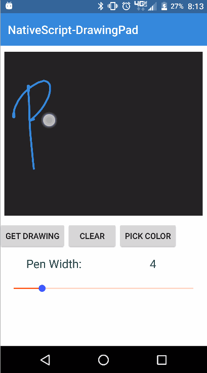
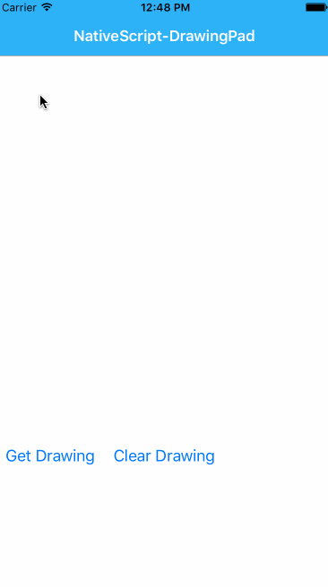

<a align="center" href="https://www.npmjs.com/package/nativescript-drawingpad">
    <h3 align="center">NativeScript DrawingPad</h3>
</a>
<h5 align="center">
NativeScript plugin to provide a way to capture any drawing (signatures are a common use case) from the device. You can use this component to capture really anything you want that can be drawn on the screen.</h4>

<p align="center">
    <a href="https://www.npmjs.com/package/nativescript-drawingpad">
        
    </a>
    <a href="https://www.npmjs.com/package/nativescript-drawingpad">
        
    </a>
    <a href="https://github.com/bradmartin/nativescript-drawingpad/stargazers">
        
    </a>
     <a href="https://github.com/bradmartin/nativescript-drawingpad/network">
        
    </a>
    <a href="https://github.com/bradmartin/nativescript-drawingpad/blob/master/src/LICENSE.md">
        
    </a>
    <a href="https://paypal.me/bradwayne88">
        
    </a>
    <a href="http://nstudio.io">
      
    </a>
    <h5 align="center">Do you need assistance on your project or plugin? Contact the nStudio team anytime at <a href="mailto:team@nstudio.io">team@nstudio.io</a> to get up to speed with the best practices in mobile and web app development.
    </h5>
</p>

---

## Installation

From your command prompt/termial go to your app's root folder and execute:

#### NativeScript 4x

`tns plugin add nativescript-drawingpad`

#### NativeScript 3x

`tns plugin add nativescript-drawingpad@2.1.1`

#### NativeScript < 3

`tns plugin add nativescript-drawingpad@1.1.2`

## Samples

| Android                               | iOS                               |
| ------------------------------------- | --------------------------------- |
|  |  |

#### Native Libraries:

| Android                                                                         | iOS                                                       |
| ------------------------------------------------------------------------------- | --------------------------------------------------------- |
| [gcacace/android-signaturepad](https://github.com/gcacace/android-signaturepad) | [SignatureView](https://cocoapods.org/pods/SignatureView) |

## Video Tutorial

[Egghead lesson - https://egghead.io/lessons/javascript-capture-drawings-and-signatures-in-a-nativescript-app](https://egghead.io/lessons/javascript-capture-drawings-and-signatures-in-a-nativescript-app)

## Usage

#### XML:

```XML
<Page xmlns="http://schemas.nativescript.org/tns.xsd" xmlns:DrawingPad="nativescript-drawingpad" loaded="pageLoaded">
    <ActionBar title="NativeScript-DrawingPad" />
    <ScrollView>
        <StackLayout>

            <DrawingPad:DrawingPad
            height="400"
            id="drawingPad"
            penColor="{{ penColor }}" penWidth="{{ penWidth }}" />

        </StackLayout>
    </ScrollView>
</Page>
```

### TS:

```TS
import { topmost } from 'ui/frame';
import { DrawingPad } from 'nativescript-drawingpad';

// To get the drawing...

  public getMyDrawing() {
      let drawingPad = topmost().getViewById('myDrawingPad');
      drawingPad.getDrawing().then((res) => {
          console.log(res);
       });  
    }


// If you want to clear the signature/drawing...
public clearMyDrawing() {
    let drawingPad = topmost().getViewById('myDrawingPad');
    drawingPad.clearDrawing();
}
```

## Angular:

```javascript
import { Component, ElementRef, ViewChild } from '@angular/core';
import { registerElement } from 'nativescript-angular/element-registry';

registerElement('DrawingPad', () => require('nativescript-drawingpad').DrawingPad);

@Component({
  selector: 'drawing-pad-example',
  template: `
    <ScrollView>
        <StackLayout>
            <DrawingPad #DrawingPad 
            height="400" 
            id="drawingPad" 
            penColor="#ff4081" penWidth="3">
            </DrawingPad>

            <StackLayout orientation="horizontal">
                <Button text="Get Drawing" (tap)="getMyDrawing()"></Button>
                <Button text="Clear Drawing" (tap)="clearMyDrawing()"></Button>
            </StackLayout>
        </StackLayout>
    </ScrollView>
    `
})
export class DrawingPadExample {
  @ViewChild('DrawingPad') DrawingPad: ElementRef;

  getMyDrawing(args) {
    // get reference to the drawing pad
    let pad = this.DrawingPad.nativeElement;

    // then get the drawing (Bitmap on Android) of the drawingpad
    let drawingImage;
    pad.getDrawing().then(
      function(data) {
        console.log(data);
        drawingImage = data;
      },
      function(err) {
        console.log(err);
      }
    );
  }

  clearMyDrawing(args) {
    var pad = this.DrawingPad.nativeElement;
    pad.clearDrawing();
  }
}
```

## Attributes

**penColor - (Color)** - _optional_

Attribute to specify the pen (stroke) color to use.

**penWidth - (int)** - _optional_

Attribute to specify the pen (stroke) width to use.

## Methods

**getDrawing()** - Promise _(returns image if successful)_

**clearDrawing()** - clears the drawing from the DrawingPad view.

**getDrawingSvg()** - Promise (returns a Scalable Vector Graphics document)

#### _Android Only_

* **getTransparentDrawing()** - Promise (returns a bitmap with a transparent background)
